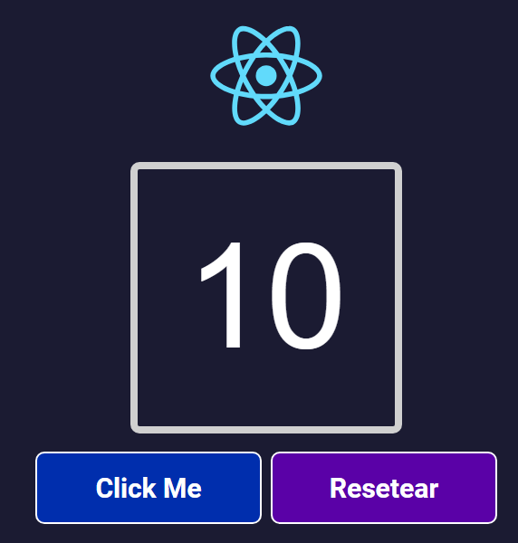
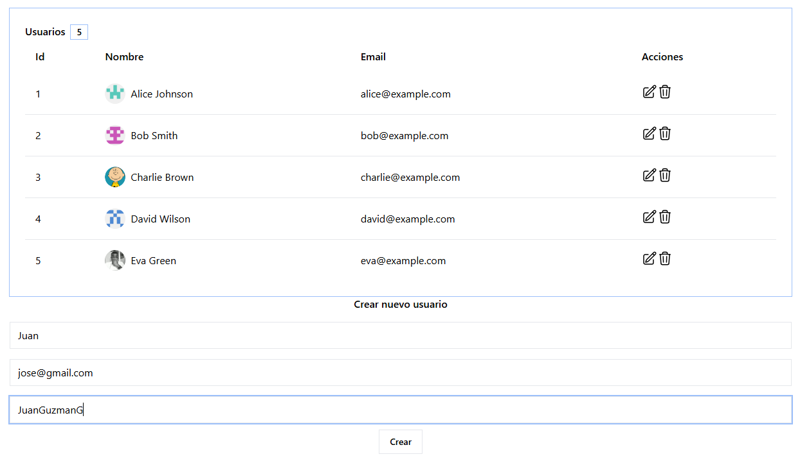
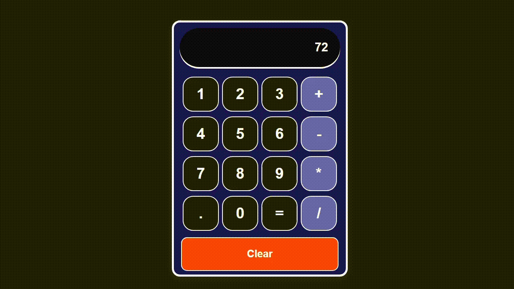
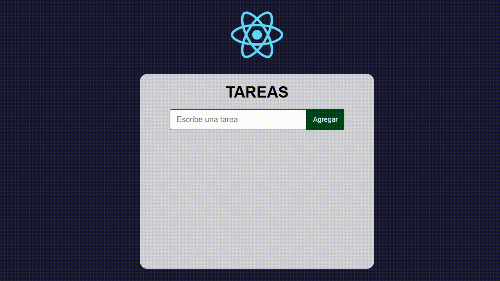

# Proyectos React

## Testimonios
Aplicación React que renderiza un listado de testimonios.
Cada testimonio se muestra con un componente funcional <Testimonio />, al que se le pasan los datos (nombre, país, cargo, e-mail, texto e imagen) como **props**:
- la capa de datos (array de objetos en un módulo independiente);
- la capa de presentación (componente reutilizable);
- y la lógica de mapeo (map() en App.js).
modificando el archivo de datos para añadir o quitar testimonios sin tocar el JSX.

## Contador
pequeño contador que permita incrementar un valor cada vez que el usuario hace clic en un botón.
- uso de Hook para almacenar valor de contador
- Manejador onClick para llamar funcion de actualizacion
- Vinculo de eventos DOM y acutalizacion de UI

## CRUD-REACT-REDUX-TREMOR
Ejercicio practico - CRUD de usuarios con React, Redux Toolkit y Tremor: añade, lista y borra perfiles, persiste en localStorage, todo montado con Vite.

## Calculadora
Calculadora básica hecha con React. Permite a los usuarios realizar operaciones aritméticas simples (suma, resta, multiplicación y división) a través de una interfaz gráfica.

### Administrador de tareas
pequeño administrador de tareas, se puede crear, eliminar y completar tareas.

